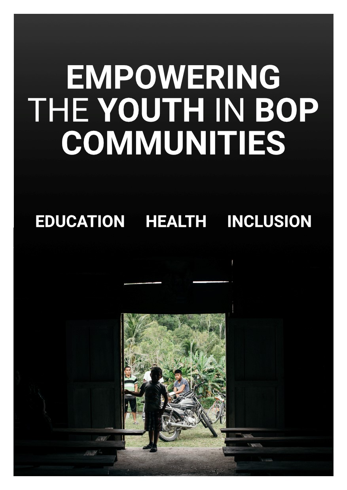

---
hide:
    - toc
    - H1
---

## Bootcamp

This week was our first formal week of the program. We got to know ourselves, our classmates and our surroundings all better as we begin to understand the context upon which we will be creating. The excitement is high. I really enjoyed going to different places around Poble Nou to get to know spaces, people and ideas which we will be interacting with. The way MDEf allows students to participate inside this wide ecosystem and inspire us make our ideas a reality is empowering.

I am beginning to grasp the power of being a designer and the impact I can have for a healthier, more sustainable and conscious future.

My vision:
I dream that everyone, disregarding economic status, can enjoy basic health and education services.

I dream of a world where health is safe, reliable, and convenient for all disregarding location or economic status.

I dream that the Base of the Pyramid (BoP) has the tools, knowledge and capabilities to sustainabily co-create a new future filled with opportunities and dreams made true.

I dream that future generations are educated in how to eat, exercise and live a healthy life.

I dream that future generations will live by sustainable practices, honor and respect the planet and all inside it.

I dream of an integrated digital global community.

I dream that the youth in the BoP will change the world by becoming a powerhouse of value generation.

I dream that people will live with consciousness, aware of the beauty of life and the importance of making the best of this great gift.

I dream that humans contaminate less than they restore.
