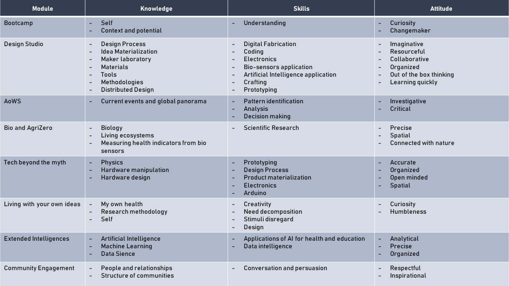

---
hide:
    - toc
    - <h1>
---
#
## Bootcamp

This week was our first formal week of the program. We got to know ourselves, our classmates and our surroundings all better as we begin to understand the context upon which we will be creating. The excitement is high. I really enjoyed going to different places around Poble Nou to get to know spaces, people and ideas which we will be interacting with. The way MDEf allows students to participate inside this wide ecosystem and inspire us make our ideas a reality is empowering.

I am beginning to grasp the power of being a designer and the impact I can have for a healthier, more sustainable and conscious future.

## Vision and Identity

I understand life as a Spiral in constant expansion. Time in motion as a driver for evolution. A dance, a movement, a spontaneous exgange of energy. I decided to use this symbol to express my Personal Development Plan for the master program. My knowledge, skills and attitude make waves that shape a spiral as it expands the person I dream to become in the future.

I am excited to become the person I need to be in order to shape the future I envision.

#
## Mapping my Ecosystem

**In my reach:**

| MDEF      | Poblenou | Barcelona | World |
| ----------- | ----------- | ----------- | ----------- |
| IAAC + Elisava      | Poblenou Urban District | Barcelona Health Hub | Servir Innovation Studio |
| Staff      | Apocapoc | Institut de Salut Holistica | Reserach team GUA |
| Alumni   |  Hangar | Institut de Salut Holistica | Cendis, Pharma |
| Peers   |  Colectivo Bajel | Centro Harmonious Life | Casca, composting |
| Facilities + tools   |  Casa Taos | Clay Studio | Infrastructure |
| Network   |  PMMT | Natural Wine Club | Network |
| Fablab   |  |  | Peers and directors |
| Valldaura   |  |  |  |

| **Materials**      |
| ----------- |
| Recycled plastic pellets   |
| 3D printing Materials   |
| Clay   |
| Mushrooms   |
| Local waste   |
| Blood   |
| Pee and other human waste   |
| Plants   |

| **What is interesting?**      |
| ----------- |
| Crafting   |
| Digital Fabrication   |
| Expanding creativity   |
| Design process   |
| Coding   |
| Circular Economy   |
| Health   |
| Empowering Creation   |
| Sustainability   |
| Fungi growth   |
| Bread baking   |
| Fermentation   |
| Coffee   |
| Food and ingestion   |
| Redesigning Habits   |
| Regenerative practices   |

| **What is missing?**      |
| ----------- |
| Knowledge and skills (Coding, Technology, Digital Fabrication, Design Process, among others)   |
| Project definition and focus   |
| Glass jars, mold, and other cooking utensils   |
| Local plants   |
| Books   |
| Sensors   |
| Camera   |
| Seeds   |
| Dirt   |
| Gardening tools   |
